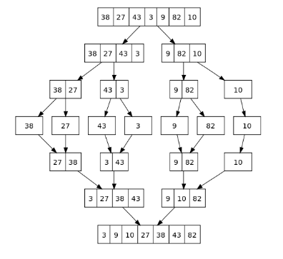
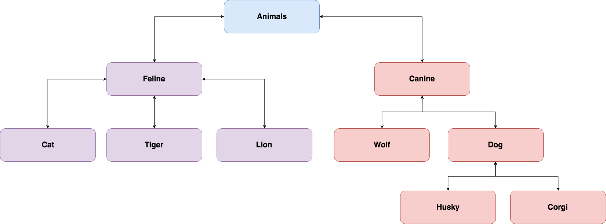

# DSA Assessment 

## Question 1

### Can you explain big O notation and why it's important?

## Question 2

### Please rank the following Big-O functions from fastest to slowest:

```
O(n), O(n log n), O(1), O(n^2), O(2^n)
```

## Question 3

### What's the time complexity of the following function?

What is the time complexity, expressed in big O notation, of the below function? This function, scrambleString, accepts a string as an argument and returns that a string with the letters randomly rearranged.

```javascript
function scrambleString(str) {
  let split = str.split("");

  split.forEach((char, idx) => {
    let randInd = Math.floor(Math.random() * split.length);
    split[idx] = split[randInd];
    split[randInd] = char;  
  });
  
  return split.join("");
}
```

## Question 4

### What's the time complexity of the following function?

What is the time complexity, expressed in big O notation, of the below function? This function, infiltrate, accepts an array as an argument. It creates an object called secretAgent and replaces a random index of an array with that object. It then returns the array.


```javascript
const infiltrate = (arr) => {
  const secretCode = Math.floor(Math.random() * Math.random() * 1000);
  const secretAgent = {
    codename: "Duchess",
    secret: secretCode
  };
  const randomInd = Math.floor(Math.random() * arr.length);

  arr[randomInd] = secretAgent;

  return arr;
}
```

## Question 5

### Which sorting algorithm is faster: Bubble Sort or Merge Sort? 

## Question 6

### What is the name of the algorithm that is taking place in this diagram?



## Question 7

### You are building a phonebook online.  You want users to search for a user and find their associated phone number.  What data structure what be best to model your data and why?

## Question 8

### Given the following code implement the `pretty print` method of a Linked List:

**Code:**
```javascript
class Node {
  constructor(value) {
    this.value = value;
    this.next = null;
  }
}

class LinkedList {
  constructor() {
    this.head = null;
    this.length = 0;
  }
}
```

**Pretty Print Output:**
```
Console Log:
-> 1 -> 2 -> 3 -> null
```

## Question 9

### Given the following code implement the Queue data structure with the following methods:

- enqueue(value) : Add new element to the end of the queue.
- dequeue() : Removes element from beginning of the queue and returns it.
- peek() : Returns the element from beginning of the queue without removing it.
- isEmpty() : Returns a boolean indicating if the queue is empty or not.

**Code:**

```javascript
class Queue {
  constructor() {
    this.arr = [];
  }
}
```

## Question 10

### Describe the following:

- What is a Hash Function is?
- What is a flaw with the Hashing function below:

```javascript
function hash(key) {
  let sum = 0;
  for (let i = 0; i < key.length; i++) {
    sum += key.charCodeAt(i);
  }
  return sum;
}

hash("Sally"); // 517
hash("Dean");  // 376
hash("Dane");  // 376
```

## Question 11

### Name a LIFO data structure and explain how it works.

## Question 12

### What kind of data structure would perfectly organize the following data? Also explain why this kind of data structure would be useful.




## Question 13

### Define a recursive function that returns the Nth fibonnaci number.

The fibonnaci sequence works like the following:
- Fibonacci sequence: [0, 1, 1, 2, 3, 5, 8, 13, 21] and fib(4), the result would be equal to 3

**Example:**

```javascript
console.log(fib(1)) // 1
console.log(fib(2)) // 1
console.log(fib(3)) // 2
console.log(fib(4)) // 3
```

## Question 14

### Define a recursive function that returns the factorial of a number.

If your number is 5, you would have:
```
5! = 5 * 4 * 3 * 2 * 1
```

The pattern:
```
0! = 1
1! = 1
2! = 2 * 1
3! = 3 * 2 * 1
4! = 4 * 3 * 2 * 1
5! = 5 * 4 * 3 * 2 * 1
```